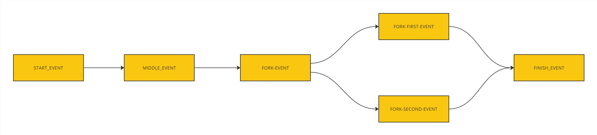
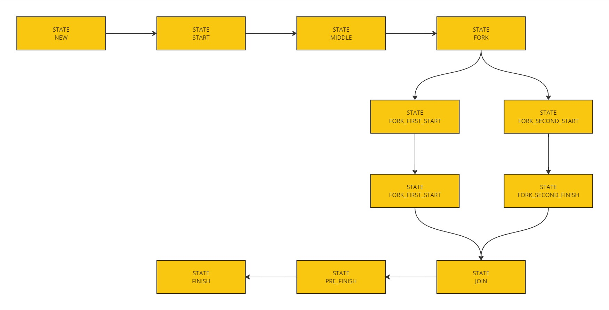

# state-machine-example
State machine implementation (with in-memory persister)

Project requirements:
- Maven 3
- Java 21

How to launch:
1) Execute from project parent `mvn clean install`
2) Launch StateMachineDemoApplication
3) Go to http://localhost:8080/swagger-ui/index.html
4) Call events according to the attached diagram and defined in the configuration

Events diagram

States diagram

